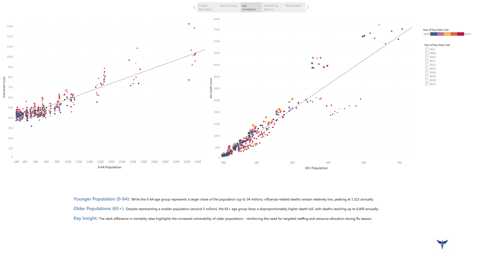
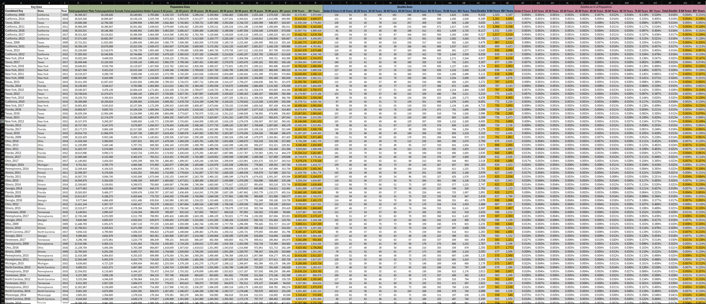
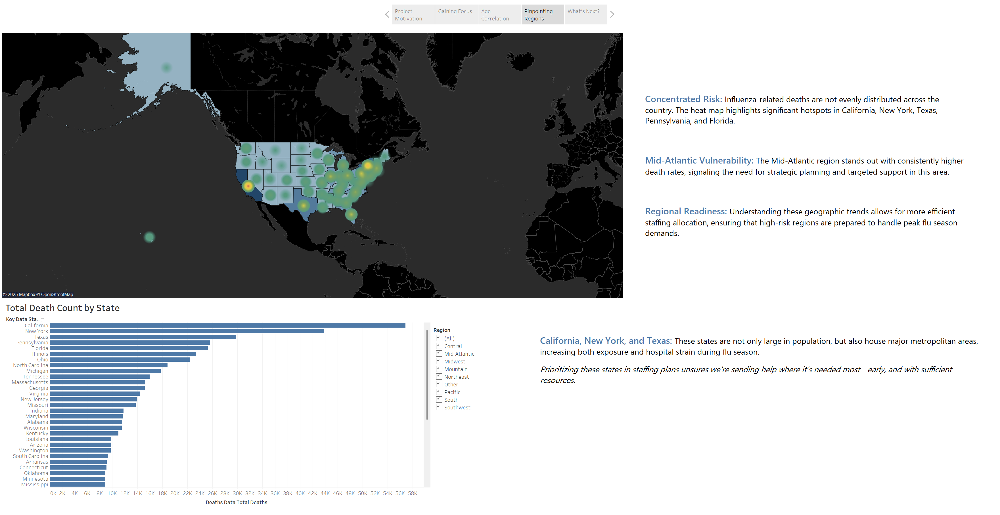

# 🦠 Influenza Mortality Analysis

### Data-driven insights into influenza mortality across U.S. populations  

---

## Overview  
This project analyzes **CDC Influenza Mortality data** in combination with **U.S. Census population data** to identify at-risk populations, with a primary focus on individuals aged 65 and older. Using **Tableau**, the project visualizes mortality trends and highlights demographic and regional disparities.  

The goal is to transform raw public health data into actionable insights that can support **public health awareness, resource allocation, and policy decisions**.  

---

## Data Sources  
- **CDC Influenza Mortality Data** (cause-specific death counts by state and year)  
- **U.S. Census Population Data** (demographic breakdowns by age group and state)

---

## Tools Used  
- **Tableau**: Interactive dashboards and visual storytelling  
- **Excel**: Data cleaning, preprocessing, and initial exploration  
- **SQL (optional, if used)**: For structuring/joining datasets before visualization  

---

## Key Insights  
- Mortality rates for influenza disproportionately affect populations aged **65 and older**.  
- Regional disparities show higher risks in certain **Midwestern and Southern states**.  
- Year-to-year variability emphasizes the importance of **monitoring seasonal trends**.  
- Interactive Tableau dashboards allow filtering by **age group, region, and year** for deeper exploration.  

### Example Analysis: Age vs Mortality  
  
*Older populations (65+) face disproportionately higher mortality despite being a smaller share of the population.*

---

## Deliverables  
- **Interactive Tableau Dashboard** (link if published on Tableau Public)  
- Cleaned datasets and preprocessing files  
- Final report summarizing findings and recommendations

  
*Combined CDC & Census dataset used for mortality rate calculations.*  

---

## Example Visualization  
_Add a screenshot of your Tableau dashboard here to make the README visually engaging:_  

## Example Visualization  
  
*Geographic hotspots show higher influenza mortality in states like California, New York, Texas, and Pennsylvania.* 

---

## Additional Resources  
- 📊 [CDC Data Portal](https://data.cdc.gov/)  
- 📈 [U.S. Census Bureau Data](https://www.census.gov/data.html)  

---

🔥 **Takeaway**: This project demonstrates how combining **public health data with demographic insights** can guide resource planning and highlight vulnerable populations.  
